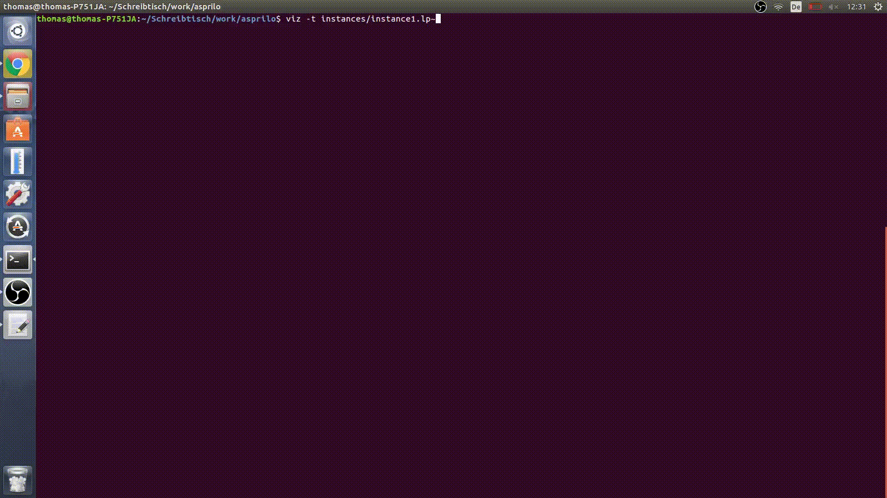
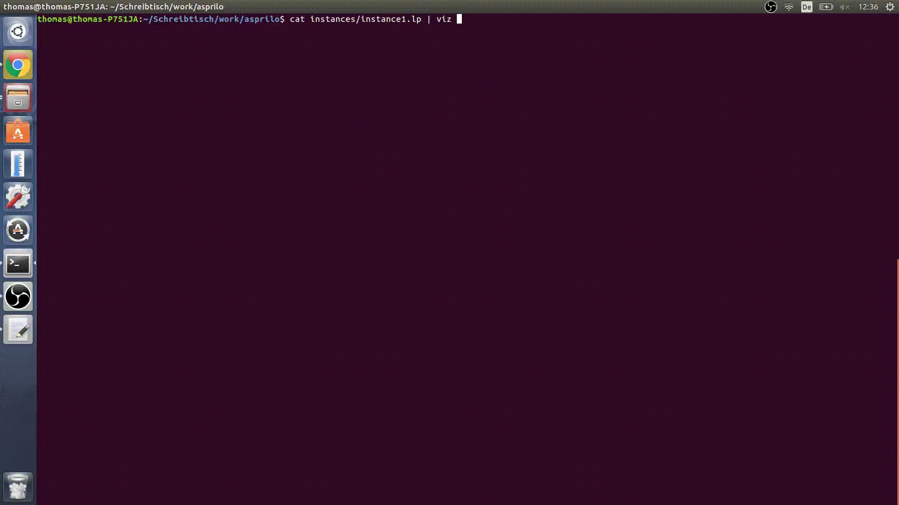
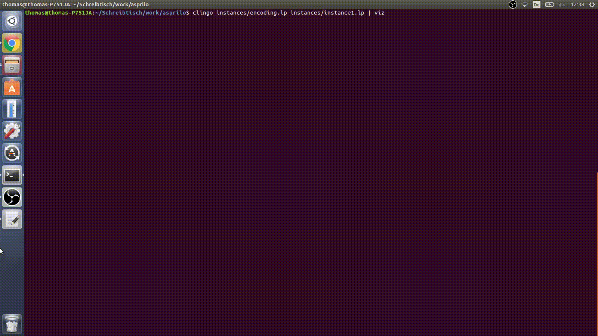
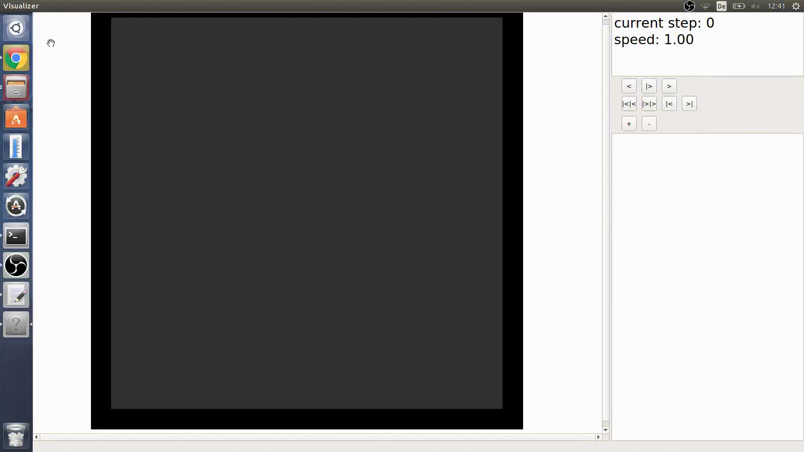
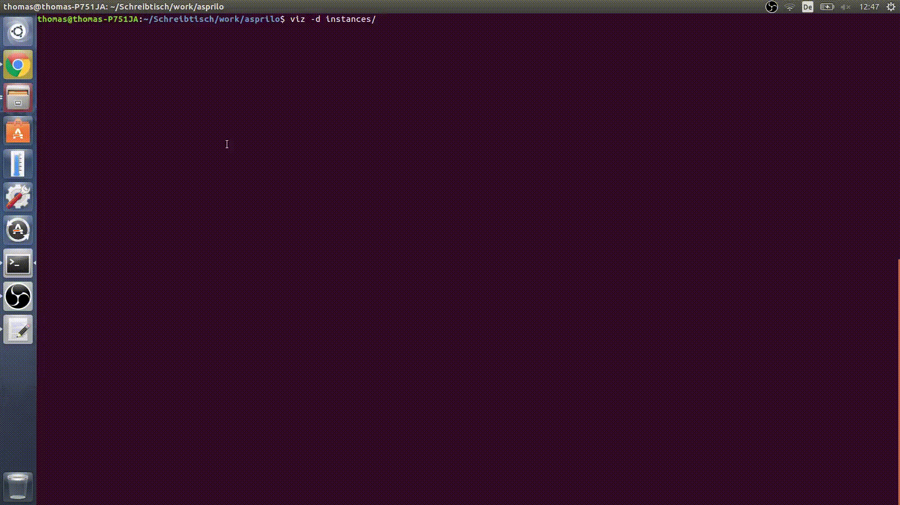
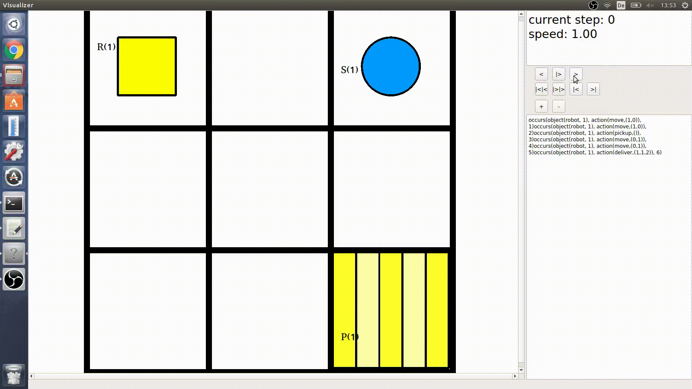
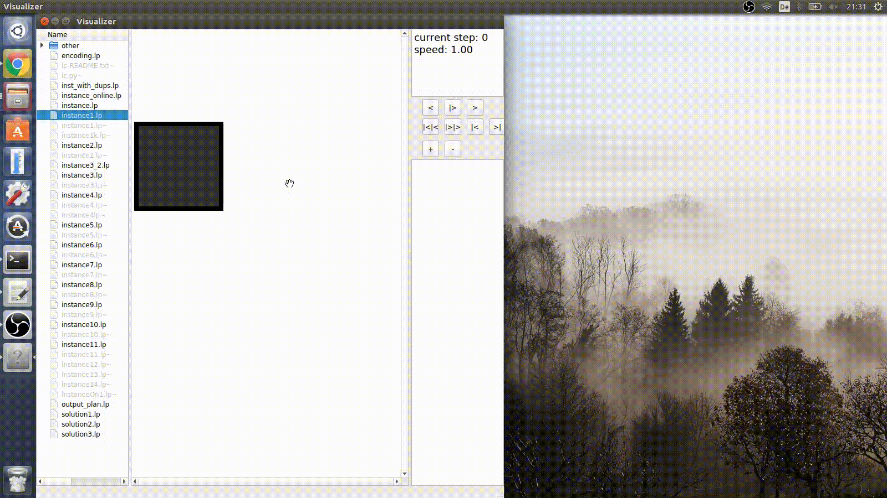
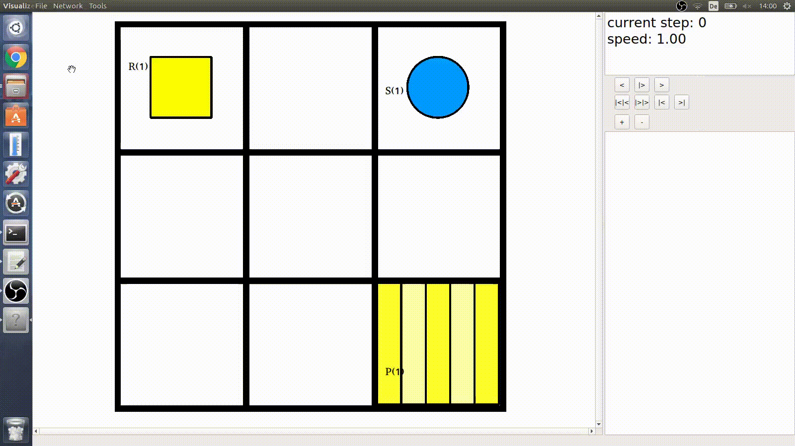
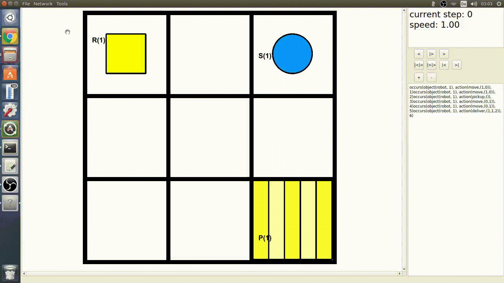

# About
This is the user manual of the instance and plan visualizer of [ASPRILO](index.md).

# Installation
It is recommended to install the visualizer with anaconda. First download and install Anaconda from [www.anaconda.com/download](https://www.anaconda.com/download). Then add the potassco channel to your `Anaconda` environment:  
`conda config --add channels potassco`  
The latest version also requires the 'dev' channel from potassco:  
`conda config --add channels potassco/label/dev`  
Now you can download and install the visualizer with the conda command:  
`conda install asprilo-visualizer`  
You can also install the visualizer without adding channels to your configuration by using just the command:  
`conda install asprilo-visualizer -c potassco -c potassco/label/dev`.  
Anaconda should install all requirements by itself. Use `viz` to run the visualizer.  

You can install the visualizer manually by downloading its source code from [https://github.com/potassco/asprilo](https://github.com/potassco/asprilo). But you must install all requirements by yourself. There is no support for this variant.

## Requirements
The visualizer requires the following software installed on your system:

1. [clingo5](http://github.com/potassco/clingo), version 5.4.0 or later
2. [Python interpreter version 3.x](http://www.python.org)
3. [Qt5](http://qt-project.org/qt5)
4. [PyQt5](http://pyqt.sourceforge.net/Docs/PyQt5/installation.html), version 5.6 or later

# Uninstallation
To remove the visualizer from your system run the command:  
`conda remove asprilo-visualizer`.

# Usage

## Features
The visualizer shows ASPRILO instances and can play a plan for the specific instance. The basic layout of the warehouse will be shown in the main window. In additional windows the order lines and the contents of all shelves are displayed. The current plan can be observed on the right side of the main window by default. If your instance and solver supports energy management you can also observe the energy status of the robots. The visualizer is able of loading multiple instances and plans and putting them together. It also provides tools to edit instances. This includes the grid size, all objects on the grid, order lines and shelf contents. The visualizer provides two network interfaces. They allow a connection to a solver and a simulator. A simulator is a program that supplies the visualizer automatically with instances and orders or plans. A solver gets an instance from the the visualizer and returns a valid plan to the visualizer.

## Visualisation
The robots are displayed as squares. The shelves are displayed as circles. Carried shelves have a second smaller circle above them. Disabled nodes are black (default) and highways are light blue (default). All other nodes are white. Picking and charging stations are displayed as striped nodes. The right side of the main window contains a text field that shows the current plan. The plan is shown in occurs/3 atoms and is sorted by the time step. The actions that are done next are highlighted. You can hover over nodes or objects with the cursor to display additional information about the objects on a node in a tooltip. If a maximal energy for a robot is defined by the init atoms a bar representing the current charge of the robot will be shown on top of the robot.

## Invocation
To run the visualizer call the command `viz`. The visualizer provides various command line options as described subsequently. To show the list of all available options in the terminal run: `viz -h`.

### Arguments
The visualizer accepts the following arguments:

- `-d/--directory`: Sets the default directory. The file browser will show this directory and files in
  it. All file dialogs for saving and loading files will have this as default directory.
- `-t/--templates`: A list of files that will be loaded at the beginning.
- `-l/--layouts`: Same as `-t/--templates`.
- `-p/--plans`: Same as `-t/--templates`.
- `-s/--start_solver`: Starts the default solver at the beginning and connect the visualizer to
  it. The default solver is the solver described in the setting file and can be changed through the settings menu.
- `-i/--start_simulator`: Starts the default simulator at the beginning and connect the visualizer to
  it. The default simulator is the simulator described in the setting file and can be changed through the settings menu.
- `-m/--mode`: Starts the visualizer in a specific mode. A mode is a preset of low-level
  settings. It turns on and off some features. By default the visualizer starts in asprilo mode. Possible modes
  are currently gtapf, complete and asprilo.
- `-c/--domainc`: The Visualizer does not issue warnings for "multiple actions are defined at time step X for deliveries".
## Loading Instances/Plans
The visualizer provides different ways to load an instance or a plan:

1. Load an instance/plan with the arguments `-t/--templates`, `-l/--layouts` or `-p/--plans`.  
  
2. Pipe an instance/plan into the visualizer.  
  
  
3. Use the file dialogs `File->Load instance [STRG + L]` or `File->Load plan [STRG + V]` to load an instance or a plan.  
  
4. Double left click on a file in the file browser to load an instance or right click and then press `load instance` or `load plan` to load an instance or a plan.  
  
5. Right click on a file in the file browser and than press `parse file` to load an instance or a plan.

If you load an instance with option 3 or 4 the visualizer will override the current model with the loaded instance. If you load a plan with 3 or 4 it will override the current actions with the loaded plan. This will not delete objects like shelves or robots. You should load a compatible instance before loading a plan.
If you load an instance or a plan via 5 this will override nothing. It will add every loaded atom from the file to the current model.
When an instance is loaded a png file that represents the instance will be created automatically. This can be disabled in the settings menu. To create png files of all instance (.lp) files in one directory and all subdirectories use `File->Create all png files`.
The file browser will only be shown if you use the `-d/--directory` argument. It can also be toggled on and off in the menu `Tools->File browser [STRG + F]`.
You can load an instance that contains a plan like instances without one.

### Piping
As mentioned in [Loading Instances/Plans](#Loading-Instances/Plans) the visualizer accepts piping from other programs such as clingo.
E.g run `clingo [ARGUMENTS] | viz [ARGUMENTS]` to pipe a clingo solution directly into the visualizer.
Your encoding should contain `#show init/2.` and `#show occurs/3.` statements to pipe correctly. It also accepts input in asp format. See [Instance format](#Instance-format) for more information.
E.g:
init(object(robot, 1), value(at, (1,1))).  
occurs(object(robot, 1), action(move, (0,1), 1)).  

### Instance format
The visualizer accepts the following atoms as input for an instance:
- `init(object([object type], [object ID]), value(at, ([X], [Y]))).`: Creates an object of the type 'object type' with the ID 'object ID' at the position ('X', 'Y'). The following object types are possible: 'robot', 'pickingStation', 'chargingStation', 'shelf', 'checkpoint', 'node', 'highway'. If you use one of the other types there must always be an object of the 'node' type at the same position.
- `init(object(robot, [robot ID]), value(carries, [shelf ID]))).`: The robot with the ID 'robot ID' carries the shelf with the ID 'shelf ID' at the beginning.
- `init(object(robot, [robot ID]), value(max_energy, [max energy])).`: Sets the maximum energy for a robot.
- `init(object(robot, [robot ID]), value(energy, [energy])).`: Sets the start energy for a robot.
- `init(object(robot, [robot ID]), value(energy_cost, ([action], [energy cost]))).`: Specifies the energy cost for a robot with the ID 'robot ID' for a specific action.
- `init(object(order, [order ID]), value(line, ([product ID], [product amount]))).`: Adds an order line to the order with the ID 'order ID'. It orders 'product amount' units of the product with the id 'product ID'.
- `init(object(order, [order ID]), value(line, ([product ID])).`: Adds an order line to the order with the ID 'order ID'. It orders products with the id 'product ID'.
- `init(object(order, [order ID]), value(pickingStation, [picking station ID])).`: Sets the destination for all order lines of an order with the ID 'order ID' to the picking station with the ID 'picking station ID'.
- `init(object(product, [product ID]), value(on, ([shelf ID], [product amount]))).`: Adds 'product amount' units of the product with the ID 'product ID' to the shelf with the ID 'shelf ID'.  
Note: All values including the id´s should be integer values. 

### Plan format
The visualizer accepts the following atoms as input for a plan:
- `occurs(object(robot, [RobotID]), action(move, ([X], [Y])), [time step]).`: The robot with the id 'RobotID' moves 'X' steps in the x direction and 'Y' steps in the y direction at the time step 'time step'.
- `occurs(object(robot, [RobotID]), action(pickup, ()), [time step]).`: The robot with the id 'RobotID' picks up the shelf on the same position as the robot at the time step 'time step'.
- `occurs(object(robot, [RobotID]), action(putdown, ()), [time step]).`: The robot with the id 'RobotID' puts down the carried shelf at the time step 'time step'.
- `occurs(object(robot, [RobotID]), action(charge, [charged amount]), [time step]).`: The robot with the id 'RobotID' will be charged by 'charged amount' at the time step 'time step'.
- `occurs(object(robot, [RobotID]), action(deliver, ([order ID],[product ID],[product amount])), [time step]).`: The robot with the id 'RobotID' delivers 'product amount' products with the id 'product ID' from the carried shelf for the order 'order ID' at the time step 'time step'.
- `occurs(object(robot, [RobotID]), action(deliver, ([order ID], [product ID])), [time step]).`: The robot with the id 'RobotID' delivers products with the id 'product ID' from the carried shelf for the order 'order ID' at the time step 'time step'.
- Other 'occurs' atoms are ignored.
- If you use `occurs(object(robot, [RobotID]), action(deliver, ([order ID], [product ID])), [time step]).` instead of `occurs(object(robot, [RobotID]), action(deliver, ([order ID],[product ID],[product amount])), [time step]).` the visualizer cannot track the amount of removed products from shelves.

## Controls
You can find the control widget on the right hand side of the visualizer. It provides a few buttons to control the visualization. For most buttons there are also keyboard shortcuts. Use the `>` button or the `[UP]` key to go one time step forward in the plan or the `<` button or the `[Down]` key to go one time step backwards. You can pause and unpause the automated visualisation with the `|>` button or `||` button or the `[Space]` key. The `|<|<` button or the `[Left]` key and `|>|>` button or the `[Right]` key speeds the visualisation up or slows it down. To skip to the end of the plan or restart it use the `>|` or `|<` buttons. You can use the mouse wheel, the `+` and `-` buttons or the `+` and `-` keys to zoom in and out.  

## Parser
You can open the parser with the `[STRG + P]` keys or the menu `Tools->Parser`. The parser shows all loaded programs in the left text field. A program can be an instance or a plan. If more than one program is loaded you can use the tabs to switch between them. The programs can be modified. The right text field shows all atoms that are currently in the solvers model. Use the `reset grounder` button to clear them. The `reset actions` button will clear all current actions in the current model while the `reset model` button will clear the whole model including all objects and all actions. You can reload the current shown program with `reload program` and delete it with `delete program`. `delete programs` will delete all current loaded instances from the parser and will reload all default files that are set in the settings. `parse programm` will sent all instances to the solver and start the solving process. The resulting model will be added to the current model. To load an instance or a plan use the methods described at [Loading Instances/Plans](#Loading-Instances/Plans). You can add an empty program be clicking the `add empty program` button.  

## Editor
The visualizer allows also the editing of instances. You can [load an instance](#Loading-Instances/Plans) or create a new one `File->New instance [STRG + N]`. To remove or add objects right click on a node on the model display. You can add and remove robots, shelves, picking stations, charging stations and highways. Objects can also be moved by drag and drop from one node to another. Objects can only be dropped into enabled nodes. To enable a node right click on a disabled node and left click in the context menu on `enable node`. You also can disable nodes by right click on a enabled node and left click in the context menu on `disable node`. Use the grid size window `Tools->Grid Size` to adjust the grid of the instance. Products can be edited in the orders window `Tools->Orders`. To add a product right click on a shelf and choose `add product`. Right click on a product entry and then click on `remove product` to remove a product from a shelf. Orders can be edited the same way in the orders window `Tools->orders`. If a robot and a shelf are on the same node you can use the `pick up` or `put down` option in the nodes context menu to let the robot pick up or put down the shelf. You can edit an instance until the instance was sent to the solver or a plan was loaded. As soon as one `occurs` atom was added to the model it is no longer possible to edit it. To save an instance use `File->Save instance [STRG + I]`. To save a plan use `File->Save plan [STRG + A]`.  
  

## Tools
If you open the orders window, the products window or the tasks window in the `Tools` menu or with shortcuts these windows will be added to the right hand side of the main window. To create separate windows just drag and drop these windows on the desktop. Most windows can be drag and dropped to create new windows or put multiple windows together in one. The tasks window will only be available in gtapf mode while the orders window and the products window will only be available in asprilo mode. While the visualisation of a plan the orders table and the task table are highlighting orderlines and tasks that are changed. If you are using a interactive solver script you can use the orders window to add new orders while displaying a solution. Add new orders and click on `send orders` to send all added orders to the solver. The solver will calculate a new plan and send it to the visualizer. The new plan will regard the new orders. With a simulator script you can automate this process. You also can discard added orders by clicking on the `discard orders` button. Only highlighted orders will be send or discarded. All orders that are displayed in the orders table but are not regarded by the plan are highlighted. You can use the paths tool to show the paths of individual robots. Click at the checkboxes to enable or disable a robot path and then click on the `ok` button to apply the changes.  

## Settings
You can configure the settings in the menu `File->Settings`. You can switch between various sections by clicking on the specific tab. Click on OK to apply all changes or on cancel to quit the settings window. The colors tab allows you to change the color of most objects. At least one draw update is required to apply these changes. The controls tab allows to change the default controls. You must restart the visualizer to apply these changes. The display tab allows the configuration of the display fonts. The network section allows the configuration of the default solver and simulator host, port and command lines. That are used by the `--start_solver` and `--start_simulator` arguments to initialize the solver and simulator and by the `Solving` and `Simulate` dialogs as default input. You can also enable `auto solving` which automatically sends an instance to the solver when it is loaded by set the value of `auto solving` to `true`. You can also modify the time the visualizer waits to show the next time step of the automated visualization by changing the `step time` value. The indication is in milliseconds. Change the `file browser filter` values to change the available files in the file browser. Set it to `*.*` to enable all files. You can add more filters by separating them with the `,` character.

## Solver
You can use a solver script to solve instances and get plans as solutions. The visualizer provides a default solver script that contains different modes for solving including an one-shot, a multi-shot and an interactive/online mode. You can find it in the scipts directory [here]({{ site.asprilo_src_url }}/visualizer/scripts). If you have installed the visualizer by conda the solver will be installed too and can be run by running `viz-solver` in a console. Feel free to use this as an example to write your own solver especially if you want to look at the communication between the visualizer and the solver.   
A solver script can be started separately or with the `Network->Initialize solver` option. If you start it from the visualizer you can enter a command line to start the solver and it will be connected automatically to the visualizer. Use`Network->Solve` now to send the current model to the solver. Enter the port and host of the solver in the opened dialog. For a local solver use 127.0.0.1 as host. You can use `Network->Fast solve` or `[STRG + S]` keys to skip the host and port dialog. In this case the visualizer will choose default values. As soon as the solver sends a solution to the visualizer, the visualizer can display the received actions. If you load a new instance while the solver is solving this will not reset the solver and you can receive wrong actions. To reset the default solver you must send a new instance to it. If you start a new solver with the visualizer or close the visualizer the connection to the solver will be closed.  
  

### Communication
The visualizer uses a number of commands to communicate with a solver. All these commands begin with the characters `%$` to not confuse these commands with asp atoms. Every massage that is sent by the visualizer ends with the `\n` character and the visualizer expects that every message it receives ends with this character as well. A message that contains an additional `n` can be treated as two messages what can causes errors. If the visualizer is receiving a message the visualizer waits until the `n` character was received. So if the message is missing this character the visualizer can be stuck. Every command and every atom that is sent should be separated with the `.` token. The visualizer sends atoms from instances which are described in [Instance format](#Instance-format) and expects atoms in [Plan format](#Plan-format). The visualizer sends the following commands to a solver:  
1. `%$RESET.` will be sent if a new instance was loaded and is to be solved. The visualizer sends the new instance after this command.
2. `%$DONE([STEP]).` will be sent if the visualizer has finished the visualisation of the time step `STEP`. Since the visualizer expects an answer to this you should always send a message back to the visualizer if this command was received even if it is only an empty message `\n`. Note: An empty message should also end with `\n`.

## Simulator 
The simulator sends instances and orders to the visualizer. There is an example simulator script provided by the visualizer. You can find it in the scipts directory [here]({{ site.asprilo_src_url }}/visualizer/scripts). If you have installed the visualizer by conda the simulator will be installed too and can be run by running `viz-simulator` in a console. You can start a simulator with the `Network->Initialize simulator` option. If you start it from the visualizer you can enter a command line to start the simulator and it will be connected automatically to the visualizer. Use `Network->Simulate` to connect the visualizer to an already started simulator. Use this to connect to a separately started simulator. If you start a new simulator with the visualizer or close the visualizer the connection to the simulator will be closed. The simulator will receive the same input stream as the solver from the visualizer and the simulator should react in a similar way.  
The example simulator will send a `%$RESET.` command to the visualizer when a connection was established to clear  the visualizers old instance data. Then it will read an given instance file and will send all atoms from the file to the visualizer. The example simulator accepts the atoms described in [Instance format](#Instance-format). It also accepts atoms with a third argument. The third argument will be interpreted as a time step and the simulator will send this atom after the time step was reached.  
E.g.`init(object(order, 1), value(pickingStation, 1), 2). init(object(order, 1), value(line, (1, 1), 2).` is an order that will be sent to the visualizer when the visualizer reaches time step 2.  

